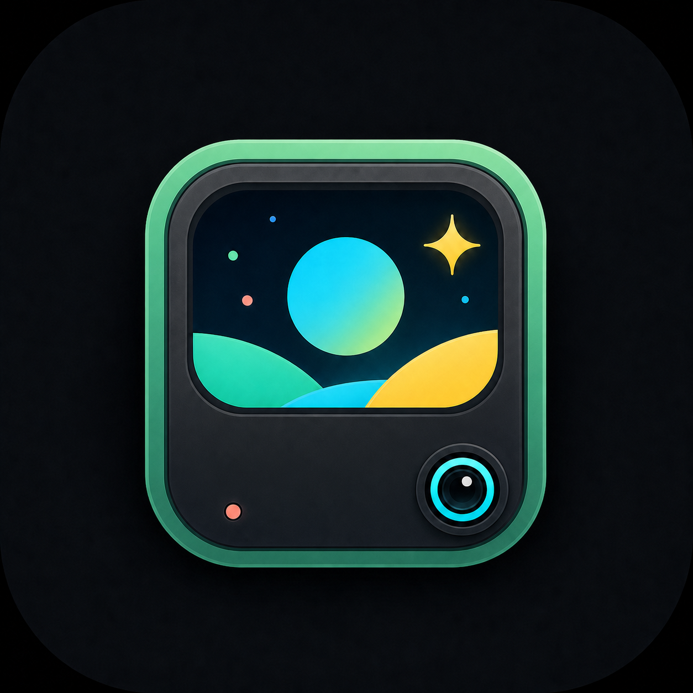

<p align="center">
  
</p>

# OuterView

OuterView 是面向小米 17 Pro / 17 Pro Max 背屏的自定义 Smart Assistant 卡片加载器。它同时是一个独立 LSPosed 模块和一个 Compose 管理器，不依赖 REAREye。

当前版本：`2.3.1`，Assistant Host API：`v5`，Wallpaper Host API：`v2`。

## AI创作声明

此项目中由GPT5.6-Sol自主完成编码和测试。不对软件的安全性、可用性和文档的正确性做任何形式的保证。如果担心 OuterView 您的设备，请不要安装 OuterView。请知悉 Orynnx 不承担由此带来的一切责任。

## 能做什么

- 从系统文件选择器导入 Smart Assistant `Widget version="2"` ZIP。
- 完成 ZIP Slip、DOCTYPE、条目数、体积和危险命令检查。
- 将模板安全部署到 `com.xiaomi.subscreencenter` 可读目录。
- 不依赖 Android 通知，直接使用宿主 Smart Assistant 原生运行管线显示和隐藏卡片。
- 删除单张或全部 OuterView 卡片，并验证背屏 runtime 已真正移除。
- 通过独立 `core` Android Library 为其他 UI 提供卡片管理端点。

## 使用条件

- 小米 17 Pro / 17 Pro Max，当前实现针对 Android 16 系统背屏服务。
- Magisk 或 KernelSU 环境及可用的 LSPosed 实现。
- LSPosed 作用域必须勾选 `com.xiaomi.subscreencenter`。

## 安装使用

1. 安装 Release APK。
2. 在 LSPosed 中启用 OuterView，并将作用域设为“小米背屏中心” `com.xiaomi.subscreencenter`。
3. 强制停止背屏中心或重启设备，使 Hook 生效。
4. 打开 OuterView，顶部应显示 Assistant 与 Wallpaper Host 的连接状态。
5. 点击右下角 `+`，选择卡片 ZIP。校验通过后会自动安装，但不会自动显示。
6. 打开卡片开关即可显示；关闭开关只隐藏，不删除模板。
7. 在更多菜单中可替换模板、编辑 payload、查看诊断或永久删除。

首次测试可直接导入 [Dino Run](demo/dino-run/dino-run.zip)。

## 仓库结构

```text
app/                 Compose 管理器与宿主 LSPosed Hook
core/                无 UI 的卡片管理 API
demo/dino-run/       可导入 ZIP、MAML 源码和预览
docs/                架构、二次开发与卡片适配文档
```

## 构建

要求 JDK 17、Android SDK 36：

Windows PowerShell：

```powershell
$env:JAVA_HOME = "C:\Program Files\Android\Android Studio\jbr"
.\gradlew.bat :core:testDebugUnitTest :app:assembleDebug
```

Linux / macOS：

```bash
export JAVA_HOME=/path/to/jdk17
./gradlew :core:testDebugUnitTest :app:assembleDebug
```

Debug APK 位于 `app/build/outputs/apk/debug/app-debug.apk`。

构建未签名 Release APK：

```powershell
.\gradlew.bat :core:testDebugUnitTest :app:assembleRelease
```

Release 产物位于 `app/build/outputs/apk/release/app-release-unsigned.apk`。公开发布前需要使用自己的长期签名密钥签名；不要把 `.jks`、密码或 `local.properties` 提交到 Git。

## 二次开发

UI 层只依赖 `RearCardManagementEndpoints`：

```kotlin
val cards = RearCardManager.create(context)
val snapshot = cards.refresh()
val result = cards.setVisible(cardId, true)
```

完整端点、状态机和 Compose 集成方式见 [二次开发指南](docs/DEVELOPMENT.md)。卡片 ZIP 的结构、元数据、payload 与安全约束见 [卡片适配指南](docs/CARD_DEVELOPMENT.md)。

## 安全边界

OuterView 只允许管理 `reareye_custom_` 前缀且位于专属目录的模板，不修改系统模板或 `notification_widget.json`。导入 ZIP 仍然属于可执行 MAML 内容，请只安装可信来源的卡片。详见 [SECURITY.md](SECURITY.md)。

## 许可证

OuterView 源码以 [GPL-3.0](LICENSE) 发布。Dino Run 的 MAML 和构建脚本同样适用 GPL-3.0；演示卡片内的媒体素材具有单独来源说明，见 [DINO-ASSETS.md](LICENSES/DINO-ASSETS.md)。

## 致谢

- REAREye 项目提供了早期背屏研究基础。
- YukiHookAPI、DexKit、KavaRef、MMKV 及 AndroidX Compose。
- 小米 Smart Assistant / MAML 运行时由设备系统提供，OuterView 与小米公司无隶属关系。
