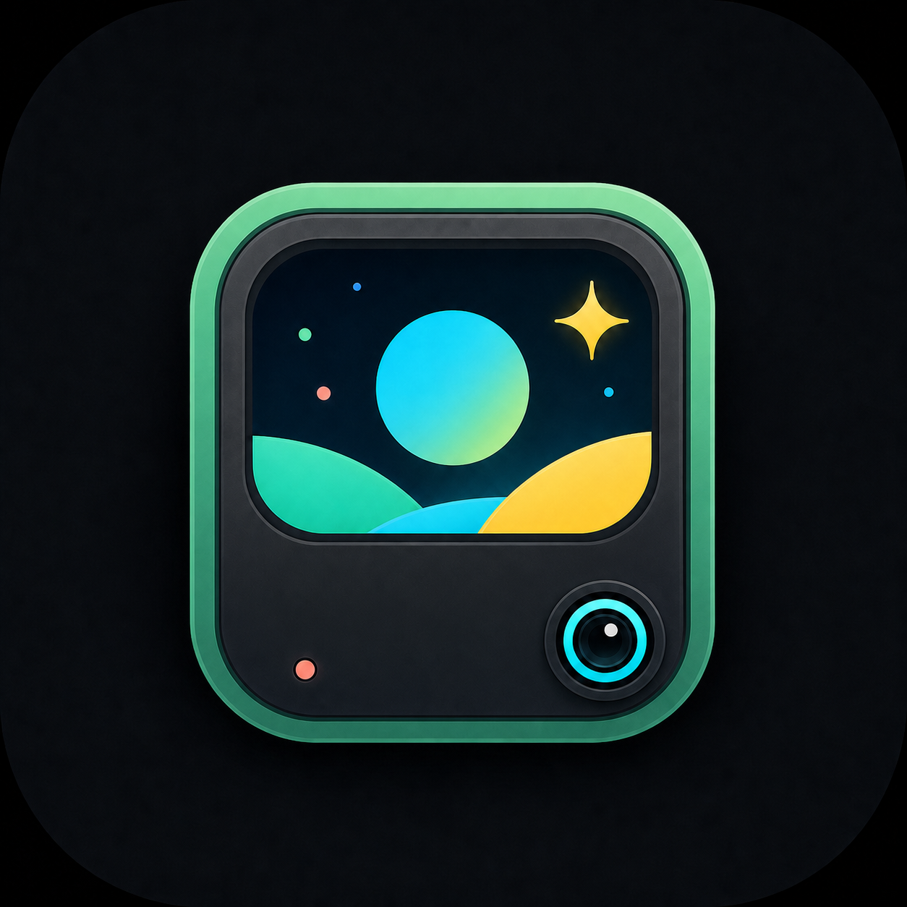

<p align="center">
  
</p>

# OuterView

OuterView 是面向小米 17 Pro / 17 Pro Max 背屏的自定义 Smart Assistant 卡片与壁纸管理器，
同时提供独立 LSPosed 模块和 Compose 管理界面。

当前版本：`2.3.2`；Assistant Host API：`v5`；Wallpaper Host API：`v2`。

## 2.3.2 的许可证迁移与独立性

- 不链接 DexKit、MMKV 或任何 GPL/LGPL/AGPL 运行时依赖。
- 使用项目自有的 DEX 查询器和 BSD-3-Clause 的 Google `smali-dexlib2` 定位 HyperOS 宿主入口。
- `core` 命名空间为 `org.orynnx.outerview.core`，新卡片使用 `outerview_custom_` 标识。
- 旧 `reareye_custom_` 标识只用于迁移本应用先前创建的数据，不会扫描或接管其他模块资源。
- 仓库附带的 Hello Card 只含项目原创 XML、元数据和打包脚本，不含外部图片、音频或字体。

2.3.2 是许可证迁移版本：当前工作树和此后分发的源码、APK 均以
[GNU GPL v3.0](LICENSE) 发布。此前已经以其他许可证取得的副本仍按其原授予条款处理；
迁移边界与可重复来源审计方法见 [许可证转换说明](docs/LICENSE_TRANSITION.md)。

## 功能

- 从系统文件选择器导入并校验 Smart Assistant `Widget version="2"` ZIP。
- 防护 ZIP Slip、DOCTYPE、异常条目数/体积，并提示危险 MAML 命令。
- 经宿主 Smart Assistant 原生运行管线安装、显示、隐藏和删除自定义卡片。
- 导入、选择、重命名和删除 OuterView 自有背屏壁纸。
- 通过无 Compose 的 `core` Android Library 提供卡片管理端点。

## 使用条件

- 小米 17 Pro / 17 Pro Max，Android 16 / HyperOS 4 背屏服务。
- Magisk 或 KernelSU，以及可用的 LSPosed 实现。
- LSPosed 作用域包含 `com.xiaomi.subscreencenter`。

## 安装使用

1. 安装 APK，在 LSPosed 中启用 OuterView 并勾选“小米背屏中心”。
2. 强制停止背屏中心或重启设备。
3. 打开 OuterView，确认 Assistant 与 Wallpaper Host 已连接。
4. 点击 `+` 导入卡片 ZIP；安装完成后手动开启显示。
5. 通过更多菜单替换模板、编辑 payload、查看诊断或永久删除。

首次测试可导入 [Hello Card](demo/hello-card/hello-card.zip)。

## 构建与验证

要求 JDK 17、Android SDK 36：

```powershell
$env:JAVA_HOME = "C:\Program Files\Android\Android Studio\jbr"
.\gradlew.bat :core:testDebugUnitTest :app:assembleDebug
py -3 demo/hello-card/build_card.py --check
```

Debug APK 位于 `app/build/outputs/apk/debug/app-debug.apk`。许可证审计命令见
[许可证转换说明](docs/LICENSE_TRANSITION.md)，第三方通知见
[`LICENSES/NOTICE.md`](LICENSES/NOTICE.md)。这些通知也会嵌入 APK 的 `assets/`。

## 仓库结构

```text
app/                 Compose 管理器、独立 DEX 查询器与 LSPosed Hook
core/                无 UI 的卡片/壁纸 Host API
demo/hello-card/     最小 MAML 卡片
LICENSES/            运行时依赖许可证和通知
tools/               相似代码与依赖审计工具
docs/                架构、二次开发和迁移说明
```

## 安全边界

OuterView 新资源固定使用 `outerview_custom_` / `outerview_wallpaper_` 前缀及专属 registry。
系统模板、系统持久化文件和其他模块资源不属于管理范围。旧前缀只在本应用签名权限保护的
Host API 和本应用 registry 记录共同成立时兼容。导入 ZIP 仍是可执行 MAML 内容，请只安装
可信来源的卡片。详见 [SECURITY.md](SECURITY.md)。

## AI 创作声明

此项目部分编码和测试由 GPT-5.6-Sol 完成。软件按 GPL-3.0 的条款提供，不对安全性、
可用性或文档正确性作额外保证。

## 声明

小米、HyperOS、Smart Assistant 与 MAML 的相关权利归各自权利人所有。OuterView 是独立
社区项目，与小米公司及其他背屏模块项目均无隶属或背书关系。
