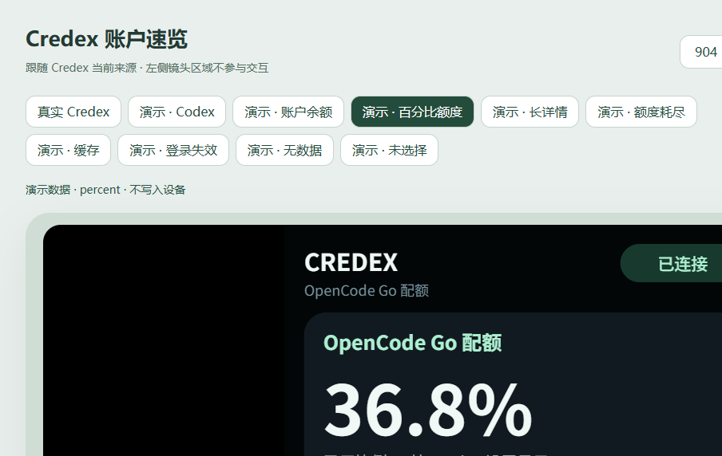

# OuterView

OuterView manages intelligent apps on Xiaomi rear displays. It imports local JsCanvas packages, lists applied apps, and removes them through Xiaomi's native management flow.

Current version: **3.0.0**. Requires root, LSPosed, and a compatible Themes app with native rear-display intelligent-app support. There is currently no Shizuku backend. Compatibility must be checked for each HyperOS version.

[Download APK](https://github.com/Orynnx/OuterView/releases/download/v3.0.0/OuterView-3.0.0.apk) · [Download Credex rear app](https://github.com/Orynnx/OuterView/releases/download/v3.0.0/Credex-account-1.1.0.zip)

## Use

1. Install the APK and enable OuterView in LSPosed.
2. Select **Themes, `com.android.thememanager`**, as the module scope, then restart the Themes app.
3. In rear-display settings, tap **OuterView 智能应用** below the AI-generated app entry in the app-card group. This starts the Themes host before opening the separate manager activity. The launcher opens About, version, and updates only. Select a trusted ZIP/MRC package in the manager.
4. Review the preview, choose a name, and confirm import. For an app marked "Not registered on the rear display", confirm "Restore display" to restore its registration using the original ID and resources. You can also confirm removal or open the system intelligent-app manager.

"Registered on the rear display" means a persistent registration exists; it does not establish that the app is currently rendering. If an operation is unconfirmed or import fails, refresh the list or check the system intelligent-app manager before importing again. After a restore or removal failure, refresh from the dialog and select the app again.

Both native AI apps and locally imported apps use the native management flow. Removing an app without a rear-display registration deletes its system management record and preserves its resource files. JavaScript runs in the rear-display host; package validation is not a sandbox or proof of device compatibility.

Version 3.0 removes the former Assistant and wallpaper managers and their Host APIs. **Existing legacy cards and wallpapers are neither automatically deleted nor migrated.**

## Credex rear app and updates

The original [Credex account dashboard](demo/credex-account/README.md) follows the Assistant source selected in Credex. Codex displays its two quota windows; other services display their original balance or quota, status, and paginated details. Swipe to navigate, long press to hide values and details, and tap to requery. The package supports ContentProviderBinder and native MAML commands without a capability blacklist.



About checks this repository's latest stable GitHub Release. Local `-dev` builds can upgrade to the matching stable version. Release APKs use `OuterView-X.Y.Z.apk` and the existing signing identity. Previously distributed 3.0.0-dev APKs need a manual upgrade to this fixed version. Rear app packages do not update automatically; import the new package when available.

## Build

Use JDK 17 and Android SDK 37:

```bash
./gradlew :core:testDebugUnitTest :app:testDebugUnitTest :app:assembleDebug
python3 demo/tap-counter/build_example.py
node --test demo/credex-account/test.js
```

On Windows, use `.\gradlew.bat` and `py -3`. The debug APK is written to `app/build/outputs/apk/debug/app-debug.apk`. `assembleRelease` produces an optimized unsigned APK; sign it with the existing key before publishing. The manager entry has been user-confirmed on Xiaomi 17 Pro. The Credex app has passed logic, browser, and package-parser checks; native execution is pending device validation.

The original [tap-counter example](demo/tap-counter/README.md) is a starting point for local app development. See [package format](docs/CARD_DEVELOPMENT.md), [Core API](docs/DEVELOPMENT.md), [architecture](docs/ARCHITECTURE.md), and [security](SECURITY.md).

The source is distributed under [GNU GPL v3.0](LICENSE). Historical licensing details remain in [LICENSE_TRANSITION.md](docs/LICENSE_TRANSITION.md); third-party notices are in [LICENSES/NOTICE.md](LICENSES/NOTICE.md).

OuterView is an independent community project and is not affiliated with or endorsed by Xiaomi.
