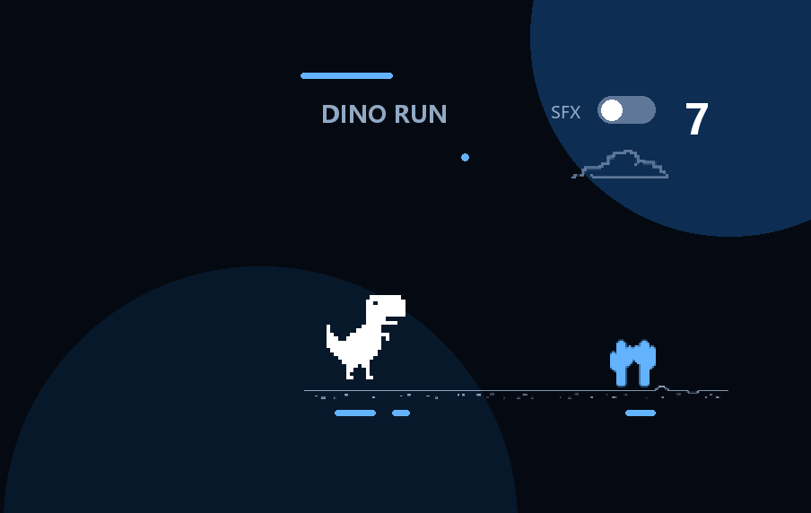

# Dino Run Demo

一个已经在小米背屏真机验证的 Smart Assistant Widget v2 交互卡片。



## 体验

直接在 OuterView 中导入 `dino-run.zip`。轻触开始，游戏中轻触跳跃，碰撞后轻触重来。右上角 `SFX` 控制音效，默认关闭。

## 源码

`card/` 就是 ZIP 根目录：

- `manifest.xml`：MAML 游戏状态、跳跃、碰撞和触摸逻辑。
- `reareye-card.json`：名称、作者、版本与默认 payload。
- `assets/`：运行时实际使用的图片和音效。

重新打包：

```bash
python demo/dino-run/build_demo.py
```

校验仓库内 ZIP 是否与源码一致：

```bash
python demo/dino-run/build_demo.py --check
```

媒体来源和许可证边界见 [DINO-ASSETS.md](../../LICENSES/DINO-ASSETS.md)。
